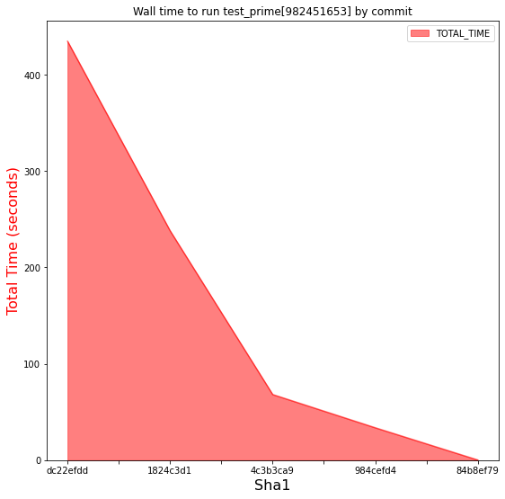
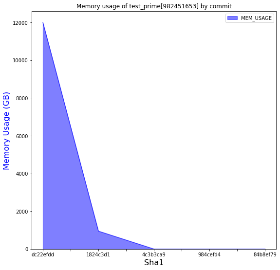
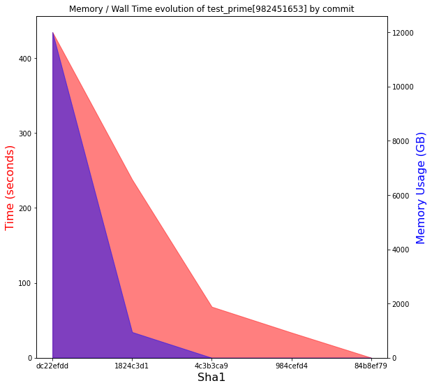

### Monitor your Python tests to optimise your code!

Jean-Sébastien Dieu, Architect @ [CFM](https://www.cfm.fr)

jean-sebastien.dieu@cfm.fr

--- ---

##### Context

- We are a Python developer.
- Implement a resource critical function <!-- .element: class="fragment" data-fragment-index="1" -->
   - Lower memory consumption <!-- .element: class="fragment" data-fragment-index="2" -->
   - Calls do not last more than a few tenth of a seconds <!-- .element: class="fragment" data-fragment-index="3" -->

---

##### Questions 

* How can we prove the algorithm performs adequatly?
* How do we monitor the resource consumption? <!-- .element: class="fragment" data-fragment-index="1" -->
* How do we compare resource usage between runs? <!-- .element: class="fragment" data-fragment-index="2" -->
* If we rely on a third party, how can we check its evolution? <!-- .element: class="fragment" data-fragment-index="3" -->

---
##### Initial attempt 

- With pytest, our test might look like:

```python [1-7]
import pytest
from my_package import is_prime


@pytest.mark.parametrize('n', [2, 3, 997, 104743, 982451653])
def test_prime(n):
    assert is_prime(n)
```

- Basic <!-- .element: class="fragment" data-fragment-index="1" -->
- timeit to assess time is a working (but poor) method <!-- .element: class="fragment" data-fragment-index="2" -->
- memory usage is not an out of the box feature <!-- .element: class="fragment" data-fragment-index="3" -->

---
 ## Pytest-monitor
---

##### About 

* Pytest plugin 
* Few requirements needed
* Small overhead 
* Track resources consumed by any test suite
    * Memory
    * Compute time (cpu, user, wall)
    * CPU usage
* Historize the results

---
##### Let's add it!

- With conda:
```bash
(my_conda_env) bash $> export CHANNEL="https://conda.anaconda.org/conda-forge"
(my_conda_env) bash $> conda install pytest-monitor -c ${CHANNEL}
```

- With pip
```bash
(my_venv) bash $> pip install pytest-monitor
``` 

---
##### Results

- Let's run ...

```bash
(my_conda_env) bash $> pytest --tag algo=naive --db monitor.db

==================== test session starts ====================
platform linux -- Python 3.6.8, pytest-4.4.1, py-1.8.0, [...]
rootdir: /home/user/projects/ospoxp/pytest-monitor
plugins: monitor-1.6.2
collected 5 items
tests/test_primality.py .....                         [ 100%]

=================== 5 passed 20.13 seconds ==================
```

- No code change required <!-- .element: class="fragment" data-fragment-index="2" -->
---

##### Fetch data
```sql
sqlite> SELECT ITEM_VARIANT, ITEM_PATH, 
   ...> MEM_USAGE, CPU_USAGE,
   ...> TOTAL_TIME, USER_TIME, KERNEL_TIME
   ...> FROM TEST_METRICS
   ...> WHERE ITEM_VARIANT = 'test_prime[982451653]';

ITEM_VARIANT|ITEM_PATH|MEM_USAGE|CPU_USAGE|TOTAL_TIME|USER_TIME|KERNEL_TIME
test_prime[982451653]|test_prime|12009.296875|0.99327179464212|434.698642253876|423.74214976|8.03175076
test_prime[982451653]|test_prime|949.5234375|0.999161495941682|238.032186746597|237.562678592|0.2699172
test_prime[982451653]|test_prime|0.55078125|0.993499555843175|68.6835398674011|68.148762272|0.08830408
test_prime[982451653]|test_prime|0.7109375|0.994411130926371|33.8781900405884|33.681455904|0.007393368
test_prime[982451653]|test_prime|0.6953125|0.0812724881534601|0.205749034881592|0.01341024|0.003311496
```

- Great, mission acomplished <!-- .element: class="fragment" data-fragment-index="1" -->
- Requires to know the sql structure <!-- .element: class="fragment" data-fragment-index="2" -->
- Does not support parallelism <!-- .element: class="fragment" data-fragment-index="3" -->

--- ---
 ## Monitor-server-API
---
##### About (1/2)

Leverage pytest-monitor with 2 building blocks:

 - API (Python)
   * dedicated to query and fetch your data
   * works seemlessly with a local pytest-monitor database
---
##### About (2/2)

Leverage pytest-monitor with 2 building blocks:

 - Server (REST)
   * manage a dedicated storage (through REST API) to insert metrics
   * enable parallelism in your test session (xdist support)

---

##### Full integration

```bash
(my_conda_env) bash $> export URL=http://my.monitor.org/api/v1
(my_conda_env) bash $> pytest --remote $URL --tag algo=naive \
                       --db monitor.db

===================== test session starts ===================
platform linux -- Python 3.6.8, pytest-4.4.1, py-1.8.0, [...]
rootdir: /home/user/projects/ospoxp/pytest-monitor
plugins: monitor-1.6.2
collected 5 items
tests/test_primality.py .....                         [ 100%]

==================== 5 passed 20.13 seconds =================
```

---

##### Example, fetching data with the API


```python
from monitor_server_api import Monitor, Field
import os

def keep_test_prime_982451653(data):
    return data.variant == 'test_prime_982451653'

mon = Monitor(os.environ['URL'])
sessions = mon.list_sessions()
metrics = mon.list_metrics_from(sessions)
metrics = metrics.filter_with(keep_test_prime_982451653)
df = metrics.to_df(sessions,
                   keep=[Field.ITEM_VARIANT, Field.TOTAL_TIME,
                         Field.ITEM_START_TIME, Field.MEM_USAGE,
                         Field.SCM])

```
---

##### Example, Visualization
<style>.container{
    display: flex;
}
.col{
    flex: 1;
}
</style>
<div class="container">
  <div class="col">
    
  </div>
  <div class="col">
    
  </div>
</div>

---

##### Example, Visualization
<style>.container{
    display: flex;
}
.col{
    flex: 1;
}
</style>
<div class="container">
  <div class="col">
    
  </div>
</div>

---

##### conclusion

* Easy to fetch and plot data
* No need to worry about internal data model <!-- .element class="fragment" data-fragment-index="1" -->
* Enables parallelism <!-- .element class="fragment" data-fragment-index="2" -->
* Perfect companion to pytest-monitor :) <!-- .element class="fragment" data-fragment-index="3" -->

--- ---

# Use Cases

---

### Know your dependencies

 - Migrating a dependencies (e.g.: pandas) can lead to
   - behavioral change
   - performance degradation on your core features
 
 - Tracking your application’s resource footprint can
   - prevent unwanted resource consumption
   - help you validate your requirements's version

---

### Know your tests

 - Applying load to a system can harm the performances
 - Analyzing resources can 
    - provide comprehensive view of tests and their category
    - help determining problems
    - validate new dev

--- ---
### Questions?
--- ---
### Addendum
---
##### Data Model

```
                  ┌─────────────────┐
                  │                 │
        ┌─────────┤  Test Metrics   ├───────┐
        │         │                 │       │
        │         └─────────────────┘       │
        │                                   │
        │                                   │
┌───────▼─────────┐                ┌────────▼───────┐
│                 │                │                │
│  Sessions Info  │                │  Machine Info  │
│                 │                │                │
└─────────────────┘                └────────────────┘
```

---
